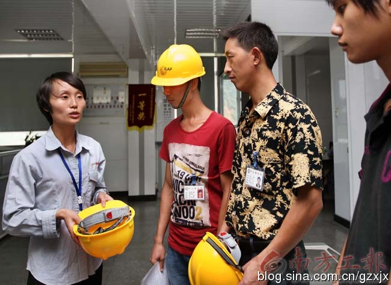
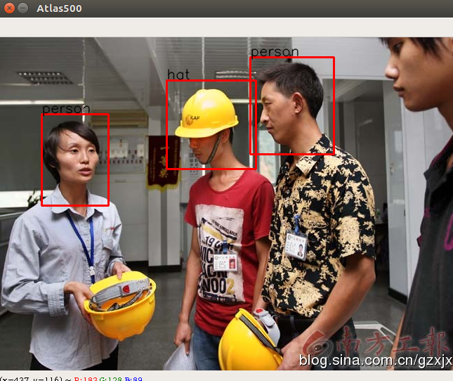

#  Atlas500 YOLOv3_TensorFlow

### 1. Introduction

该项目fork from[https://github.com/wizyoung/YOLOv3_TensorFlow](https://github.com/wizyoung/YOLOv3_TensorFlow)

- tensorflow的训练，测试完全基于原项目
- 修改了tensorflow模型转pd模型（主要修改）
- 增加了Atlas500检测结果可视化的脚本

This is my implementation of [YOLOv3](https://pjreddie.com/media/files/papers/YOLOv3.pdf) in pure TensorFlow. It contains the full pipeline of training and evaluation on your own dataset. The key features of this repo are:

- Efficient tf.data pipeline
- Weights converter (converting pretrained darknet weights on COCO dataset to TensorFlow checkpoint.)
- Extremely fast GPU non maximum supression.
- Full training and evaluation pipeline.
- Kmeans algorithm to select prior anchor boxes.

### 2. Requirements

Python version: 2 or 3

Packages:

- tensorflow >= 1.8.0 (我用的是1.8.0)
- opencv-python
- tqdm

或者直接根据配置文件安装依赖环境

`pip install -r requirements.txt`

### 3. 原项目测试

这里就跳过了

### 4. Training

按照原项目的说明一步一步走，经测试是可以走通的。

- 安全帽数据集下载地址：[安全帽数据集](https://pan.baidu.com/s/1UbFkGm4EppdAU660Vu7SdQ?errno=0&errmsg=Auth%20Login%20Sucess&&bduss=&ssnerror=0&traceid=)

#### 4.1 Data preparation 

(1) annotation file

Generate `train.txt/val.txt/test.txt` files under `./data/my_data/` directory. One line for one image, in the format like `image_index image_absolute_path img_width img_height box_1 box_2 ... box_n`. Box_x format: `label_index x_min y_min x_max y_max`. (The origin of coordinates is at the left top corner, left top => (xmin, ymin), right bottom => (xmax, ymax).) `image_index` is the line index which starts from zero. `label_index` is in range [0, class_num - 1].

For example:

```
0 xxx/xxx/a.jpg 1920 1080 0 453 369 473 391 1 588 245 608 268
1 xxx/xxx/b.jpg 1920 1080 1 466 403 485 422 2 793 300 809 320
...
```

Since so many users report to use tools like LabelImg to generate xml format annotations, I add one demo script on VOC dataset to do the convertion. Check the `misc/parse_voc_xml.py` file for more details.

(2)  class_names file:

Generate the `data.names` file under `./data/my_data/` directory. Each line represents a class name.

For example:

```
bird
person
bike
...
```

The COCO dataset class names file is placed at `./data/coco.names`.

(3) prior anchor file:

Using the kmeans algorithm to get the prior anchors:

```
python get_kmeans.py
```

Then you will get 9 anchors and the average IoU. Save the anchors to a txt file.

The COCO dataset anchors offered by YOLO's author is placed at `./data/yolo_anchors.txt`, you can use that one too.

The yolo anchors computed by the kmeans script is on the resized image scale.  The default resize method is the letterbox resize, i.e., keep the original aspect ratio in the resized image.

#### 4.2 Training

Using `train.py`. The hyper-parameters and the corresponding annotations can be found in `args.py`:

```shell
CUDA_VISIBLE_DEVICES=GPU_ID python train.py
```

Check the `args.py` for more details. You should set the parameters yourself in your own specific task.

### 5. 测试

这里用单张图片的测试脚本 `test_single_image.py` 进行测试.需要修改三个地方

- anchor_path:     训练用anchores写入的text
- class_name_path: 训练用类别名字/顺序
- restore_path:    预训练模型的位置

```shell
$ python test_single_image.py -h
usage: test_single_image.py [-h] [--input_image INPUT_IMAGE]
                            [--anchor_path ANCHOR_PATH]
                            [--new_size [NEW_SIZE [NEW_SIZE ...]]]
                            [--letterbox_resize LETTERBOX_RESIZE]
                            [--class_name_path CLASS_NAME_PATH]
                            [--restore_path RESTORE_PATH]
```

### 6. 转pd模型

这里直接写好了脚本 `convert_weight.py` , 只需要按自己的训练时的配置修改相关超参数就行
```python
num_class = 80      # 0. 类别和输入尺寸和训练时保持一直
img_size = 416
ckpt_path = "./yolov3_weights/yolov3.ckpt"
save_path = './checkpoint/yolov3_coco.pd'
anchors = parse_anchors("./data/yolo_anchors.txt")
```

### 7. pd模型转om模型

前提：需要安装好Atlas500 DDK，并配置好相应的环境变量

从Atlas500原始的samples中拷贝出aipp_yolov3_picture.cfg,不用修改其中参数。

```shell
omg --model ./yolov3_helmet.pd --framework 3 --output ./yolov3_helmet --insert_op_conf ./aipp_yolov3_picture.cfg --input_shape "Placeholder:1,416,416,3"
```

### 8. Atlas500推理修改/测试

(1) 推理修改

这里用InferObjectDetection项目进行推理。修改ObjectDetectionEngine.h中line52处两行
```cpp
const int CLASS_NUM = 2;
static float g_biases[BIASES_NUM] = {5,5, 6,7, 7,9, 10,11, 13,15, 19,21, 27,31, 43,50, 79,93};      // 训练时用的anchor尺寸超参数
```

(2) 编译

```bash
bash ./build.sh A500
```

(3) 测试

将编译得到的 `out` 文件夹+om模型+测试图片上传到Atlas500上

```shell
./ObjectDetection -i 2_1.jpg -t 1 -m ./yolov3_helmet.om -g ./graph.config -s 0 -e 0

> #0, bbox( 242,   59,  364,  190) confidence: 0.899212 classId is 0 
> #1, bbox( 357,   27,  477,  162) confidence: 0.958893 classId is 1 
> #2, bbox(  54,  112,  153,  231) confidence: 0.842112 classId is 1 
```

### 9. 结果可视化

将打印出来的检测+置信度+类别结果拷贝出来， 按copy的值修改 `atlas_result_draw.py` 中 `bbox` 的值。

`python atlas_result_draw.py`

 </img>
 </img>

## 问题

- [ ] atlas输出的结果和tensorflow的结果有一定的差别

## Reference

1. [https://github.com/wizyoung/YOLOv3_TensorFlow](https://github.com/wizyoung/YOLOv3_TensorFlow)